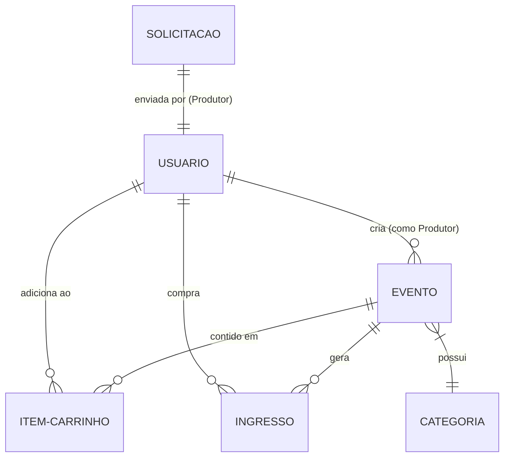

# 🌟 Evence Events 🌟

<p align="center">
  
  
  
  
  
  
</p>

---

## 📝 Sobre o Projeto

O **Evence Events** é uma plataforma moderna e completa de gerenciamento e venda de ingressos para eventos. Projetada para oferecer uma experiência de usuário excepcional e ultra-premium, a aplicação une a rapidez do **Angular v21** (com Server Side Rendering - SSR) à versatilidade do **Tailwind CSS v4** para proporcionar um layout responsivo, fluido e repleto de animações interativas.

Seja você um participante em busca do próximo show, um produtor querendo promover seu evento, ou um administrador gerenciando a plataforma, o **Evence Events** oferece todas as ferramentas necessárias com fluxos robustos e intuitivos.

---

## ✨ Principais Funcionalidades

### 🎟️ Para Clientes (Usuários Comuns)
- **Filtro e Busca Inteligente:** Encontre eventos facilmente por palavra-chave, categorias (shows, teatro, stand-up, esportes, gastronomia, arte e cultura) e cidades.
- **Carrossel Interativo:** Painel dinâmico na Landing Page destacando os eventos mais quentes com transições elegantes.
- **Carrinho de Compras:** Adicione múltiplos ingressos de diferentes eventos, escolha setores/lotes e gerencie quantidades com atualização em tempo real.
- **Checkout Dinâmico & Pagamento Simulado:** Fluxo passo a passo de compra com escolha de formas de pagamento e validações.
- **Meus Ingressos:** Painel exclusivo no perfil do usuário para gerenciar e visualizar todos os ingressos adquiridos.

### ✍️ Para Produtores de Eventos
- **Painel de Criação de Eventos:** Formulário robusto com definição de datas, horários, tipos de local (presencial ou online), links, política de reembolso e gerenciamento dinâmico de lotes de ingressos.
- **Envio para Curadoria:** Os eventos criados entram em estado de análise e aguardam a validação da administração antes de ficarem visíveis no catálogo.
- **Gerenciamento de Produções:** Acompanhe o status de todas as suas solicitações criadas.

### 🛡️ Para Administradores (Dashboard Admin)
- **Curadoria de Eventos:** Aprove ou rejeite novas solicitações de eventos enviadas por produtores de forma centralizada e ágil.
- **Gerenciamento de Usuários:** Visualize a lista completa de cadastros da plataforma, altere permissões (promover a Admin/Produtor), aplique suspensões temporárias ou exclua perfis que violam as políticas.

---

## 🛠️ Tecnologias Utilizadas

A stack tecnológica do projeto foi selecionada seguindo os padrões mais modernos de desenvolvimento web:

* **Frontend Framework:** [Angular v21.2.0](https://angular.dev/) (Standalone Components, SSR para otimização de SEO e performance).
* **Estilização:** [Tailwind CSS v4.1.12](https://tailwindcss.com/) com suporte nativo a PostCSS para uma UI rápida, elegante e fluida.
* **Linguagem:** [TypeScript v5.9.2](https://www.typescriptlang.org/) para tipagem forte e desenvolvimento seguro.
* **Servidor e Simulação de API:** [JSON Server v0.17.4](https://github.com/typicode/json-server) simulando uma API REST robusta completa baseada no arquivo local [db.json](file:///c:/Users/kevin/Documents/GitHub/evence-events/Evence-Events/db.json).
* **SSR Server Layer:** [Express v5.1.0](https://expressjs.com/) para lidar com Server Side Rendering.
* **Testes Unitários:** [Vitest v4.0.8](https://vitest.dev/) para uma execução de testes incrivelmente ágil.

---

## 📊 Arquitetura do Banco de Dados (Mock REST)

A API do projeto está modelada sob uma estrutura relacional flexível simulada através do JSON Server. O diagrama abaixo representa as relações das entidades dentro do nosso ecossistema:



---

## 📁 Estrutura do Repositório

```text
evence-events/
├── Evence-Events/               # Pasta principal do projeto Angular
│   ├── .github/                 # Workflows de CI/CD
│   ├── public/                  # Arquivos públicos e estáticos do projeto
│   ├── src/                     # Código fonte da aplicação
│   │   ├── app/
│   │   │   ├── componentes/     # Componentes globais (Header, Footer)
│   │   │   ├── interfaces/      # Interfaces TypeScript (Usuario, Evento, Carrinho)
│   │   │   ├── pages/           # Páginas / Views da aplicação (Landing page, Login, Admin, etc.)
│   │   │   ├── services/        # Serviços Angular e consumo de APIs (services.ts)
│   │   │   ├── app.routes.ts    # Rotas de navegação do app
│   │   │   └── app.ts           # Inicialização e configuração
│   ├── db.json                  # Banco de dados simulado do JSON Server
│   ├── package.json             # Dependências e scripts npm
│   └── tsconfig.json            # Configuração do TypeScript
└── package-lock.json            # Lock de dependências globais
```

---

## 🚀 Como Executar o Projeto

Para rodar a aplicação em ambiente local, siga o passo a passo a seguir.

### 📋 Pré-requisitos
- **Node.js:** Versão 18.x ou superior.
- **npm:** Versão 9.x ou superior.

### 🔌 Passo 1: Instalar as Dependências

Abra o seu terminal na pasta raiz do projeto e acesse o diretório da aplicação:

```bash
cd Evence-Events
npm install
```

### 🗄️ Passo 2: Iniciar o Banco de Dados Backend (JSON Server)

O backend simula nossa API de banco de dados na porta `3000`. No mesmo diretório `Evence-Events`, execute em um terminal:

```bash
npm run backend
```

> [!NOTE]
> Este comando iniciará o `json-server` observando o arquivo `db.json` com suporte a CORS ativado.

### 💻 Passo 3: Iniciar o Servidor Frontend (Angular)

Abra **outro terminal** no diretório `Evence-Events` e execute o servidor de desenvolvimento do Angular:

```bash
npm run start
```

Após a compilação, o seu servidor de desenvolvimento estará disponível no link:
👉 **[http://localhost:4200](http://localhost:4200)**

---

## 👤 Perfis de Teste Disponíveis

Para explorar a plataforma ao máximo com todas as permissões e funcionalidades ativadas, você pode utilizar os seguintes usuários de teste já cadastrados em nosso `db.json`:

| Perfil | E-mail | Senha | Funcionalidades Especiais |
| :--- | :--- | :--- | :--- |
| **🛡️ Administrador** | `admin@evence.com` | `Admin@2026` | Aprovar/Rejeitar eventos, Gerenciar/Suspender/Promover usuários |
| **✍️ Produtor** | `contato@megaevents.com` | `Prod@2026` | Criar novos eventos, acompanhar status e lotes |
| **🎟️ Cliente Comum** | `kevin@teste.com` | `Teste@2026` | Comprar ingressos, gerenciar carrinho, painel de ingressos |

---

## 🧪 Rodando Testes Unitários

A aplicação utiliza o **Vitest** como test runner nativo de altíssima performance para garantir a estabilidade do código. Para rodar a suite de testes, execute:

```bash
npm run test
```

---

## 💡 Recursos Adicionais e Scripts Disponíveis

Dentro de `package.json`, você dispõe dos seguintes scripts úteis:

* `npm run start` - Inicia o servidor local Angular em modo de desenvolvimento.
* `npm run backend` - Roda o servidor mock de API na porta 3000.
* `npm run build` - Compila o projeto otimizando o bundle para ambiente de produção (`dist/`).
* `npm run test` - Roda a suíte de testes unitários com Vitest.
* `npm run watch` - Executa a build observando modificações em tempo real.

---

<p align="center">
  Desenvolvido com 💖 por Kevin e a equipe Evence Events.
</p>
